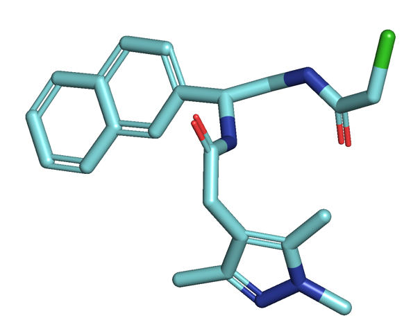
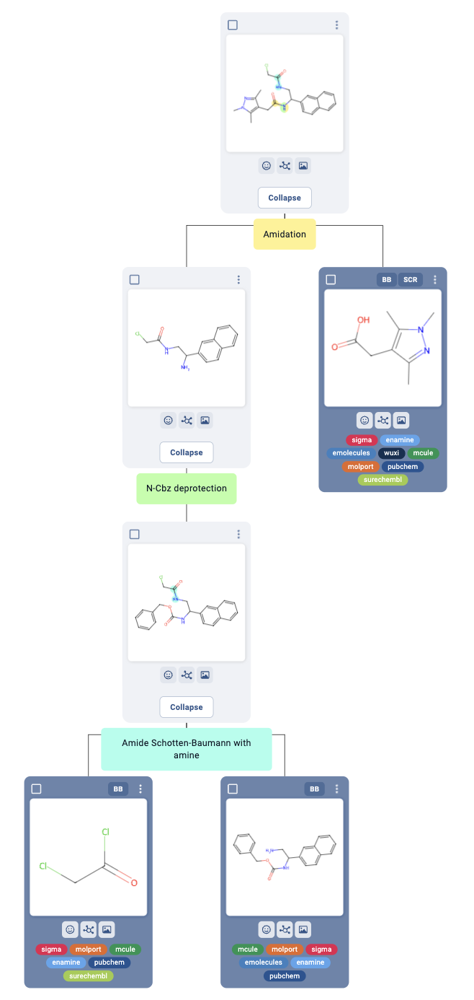
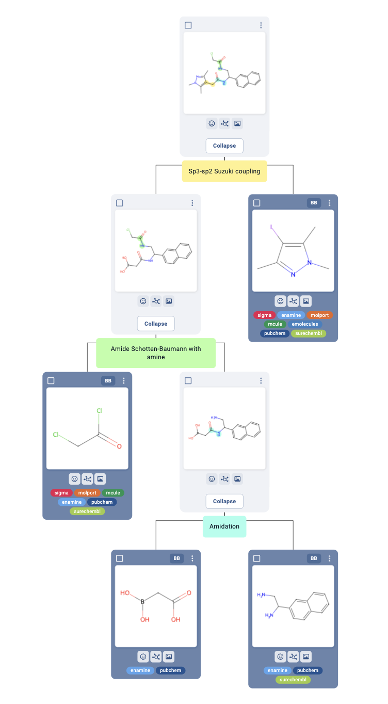
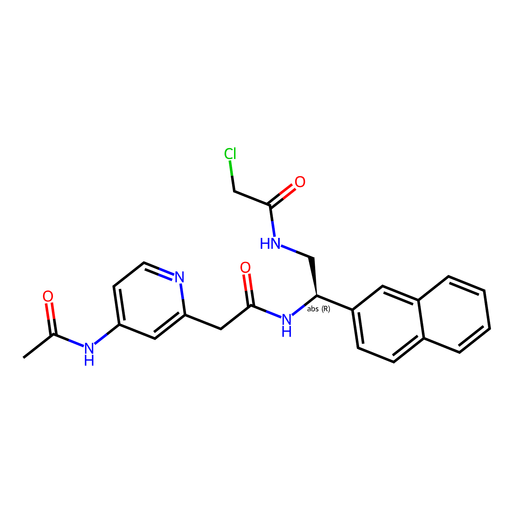
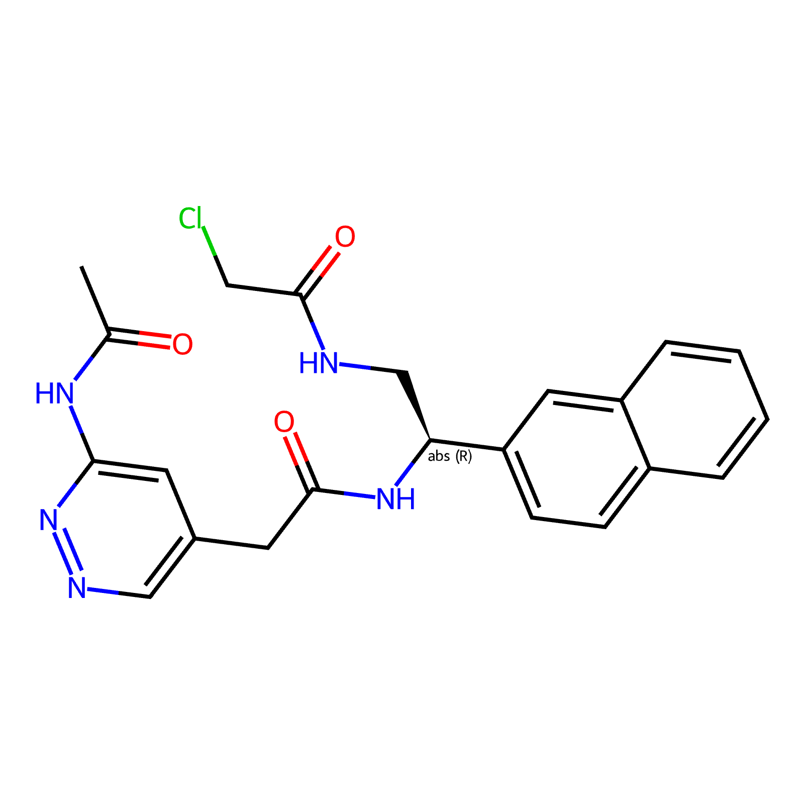
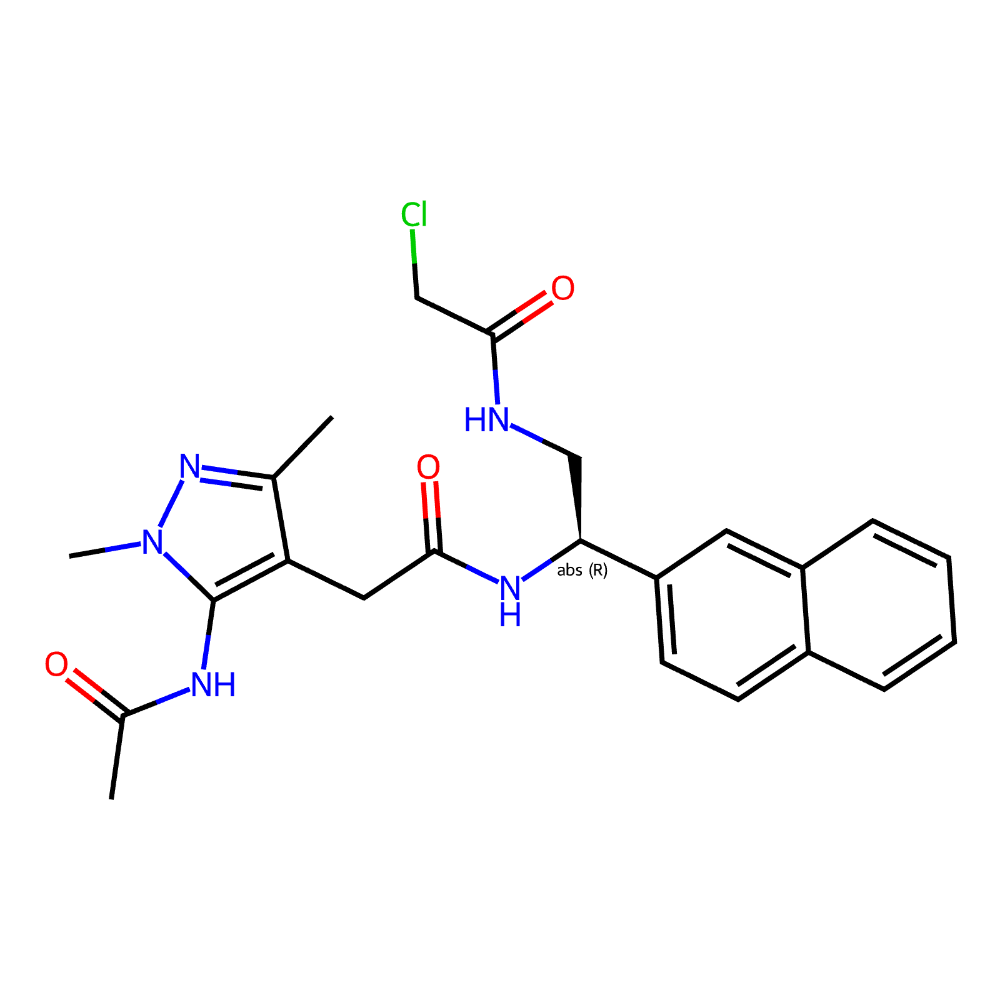

# EV-A71-2A-syndirella-run-2

## Summary

The following compound sets will be elaborated:

| Creator | Description                                                              | Number of compounds |
| ------- |--------------------------------------------------------------------------| ------------------- |
| Kate | `x1346` analogues designed manually                                      | 38 |
| Ryan | Various fragment analogues designed manually                             | 24 |
| Steph (Ryan, Max) | Knitwork compounds that were slightly modified and screened with no hits | 36 |
| Warren (Kate) | Covalent hits as themselves and their non-covalent analogues             | 8 |
| Kate | `x1346 x0926` fragments                                                  | 2 |
Total: 108

Compound sets are found in the `syndirella_input` folder.

# OLD
## Summary
Matteo has found compounds close to fragments that are starting reactants with functional groups of:
- amine (22)
- carboxylic acids (backbone side) (45)
Total combinations: 990.
> https://github.com/matteoferla/EV-A71-2A-elaborations/tree/main/iteration-3A

Since 924 is too many, two pyrazole amines were chosen to use and combine with all carboxyls as there is a trend of an
acceptor nitrogen on the pyrazole scaffold in the P1 sidechain pocket. These amines are:
EN300-14984 Cc1cc(N)n(C)n1 (`x1346` pyrazole with amine)
EN300-204033 Cc1cc(CN)n(C)n1 (`x1346` pyrazole with aminomethyl)

All the carboxyls are based on `x0487`. 

The 90 products are found here:

They are all single step amidations. 

### Part II
What if `x1346` is itself a base compound? `Cc1nn(C)c(C)c1CC(=O)N[C@@H](CNC(=O)CCl)c1ccc2ccccc2c1 |a:12|`

Example routes: https://app.postera.ai/manifold/d8aa459a-07cd-4954-9c11-a4efcd2e6faf/53a716fb-dd74-4a77-ad82-53e31bcaf2b4

Other bases:

`CC(=O)Nc1ccnc(CC(=O)N[C@@H](CNC(=O)CCl)c2ccc3ccccc3c2)c1 |a:13|`

`CC(=O)Nc1cc(CC(=O)N[C@@H](CNC(=O)CCl)c2ccc3ccccc3c2)cnn1 |a:11|`

`CC(=O)Nc1c(CC(=O)N[C@@H](CNC(=O)CCl)c2ccc3ccccc3c2)c(C)nn1C |a:10|`

### Workflow
- [x] Source fragments from https://github.com/matteoferla/EV-A71-2A-elaborations/tree/main/iteration-3A
- [x] Check that fragments I'll place against look logical. 
- [ ] Find products (hereon named scaffolds), match with fragments, prepare synthesis routes.
- [ ] Run syndirella pipeline w/ placing scaffolds first. 

## Structures

### Fragments:
Fragments downloaded directly from Fragalysis.

### Template:
Template was prepared with XX.

## Scaffolds

